# Week 1｜大腦核心：LLM 選擇與參數設定（LLM & Config）

## 一、結論與思考摘要

我一開始偏向認為較強、較貴的模型可能比較不容易被淘汰，長期反而比較划算。但實際比較模型、價格與任務後，我的理解改成：「應先確認任務需求與複雜度，再選擇能力、成本與效率適合的模型，而不是單純追求最大、最強的模型。」這是我選擇思路的改變，並不是已經證明哪一種模型的長期總成本一定較低。

我原本不知道 Parameter 與 Distillation 是什麼。現在我理解 Parameter 數量較多通常代表模型容量較大、能學習較複雜模式，但不代表一定比較準確；Distillation 則可以用我的話理解為：「讓較小模型學習較大模型的部分能力，試圖用較小容量保留部分大模型能力。」模型大小因此不能直接代替對任務需求的判斷。

在 Coze 實作時，我發現參數名稱不能只靠直覺猜測。Temperature 並不是耗能設定；Response max length 設得太小，回答可能直接停在未完成的位置。我也發現 Temperature 測試受到對話 Context 影響，不能把有限的觀察當成普遍結論。

連回數位鑑識，我目前認為不同鑑識輔助工作的複雜度不同，因此未來 Agent 不應一律使用同一個最強模型。我把方向縮小成 Examination 階段的優先查看項目推薦，希望先用虛構、整理好的資料測試是否有幫助。這仍是尚未完成與驗證的應用構想。

## 二、我原本怎麼想：模型是不是越強越值得？

面對「模型 A 能力較強、較昂貴、較慢；模型 B 較小、便宜、快速，但能力較弱」的情境，我原本選擇 A：

> A，雖然初期成本可能較高，但較強、較好的模型通常能夠使用較久、不易被時代淘汰；反之，較小、較便宜的版本可能初期成本較低，但後續的維護成本以及時代、技術的更替都可能導致其淘汰，產生更大的替換成本

因此，我真正想研究的是：

> 一開始選能力較強、價格較高的模型，長期來看真的會比使用較小、便宜的模型更划算嗎？

這個猜想讓我開始比較模型能力與價格，而不是直接把「更強」視為唯一的選擇標準。

## 三、模型與價格調查

### Gemini：官方資訊與我的閱讀理解

我查看 [Gemini 官方模型頁](https://ai.google.dev/gemini-api/docs/models)，主要比較 Gemini 2.5 Pro、Flash、Flash-Lite。以下是我閱讀後的理解，並非自行測得的效能比較：

| 模型 | 我對適用需求的理解 | 速度與成本的考量 |
| --- | --- | --- |
| Gemini 2.5 Pro | 適合複雜任務；簡單任務可能用不到其能力 | 處理可能較費時，本次比較的 API 定價較高 |
| Gemini 2.5 Flash | 我認為較適合一般日常需求 | API 定價介於另外兩者之間；本週沒有具體速度測量 |
| Gemini 2.5 Flash-Lite | 適合簡單問答與任務；複雜內容可能較容易出錯 | 我理解其速度較快，本次比較的 API 定價較低 |

> **圖片 #1｜Gemini 官方模型頁**
>
> 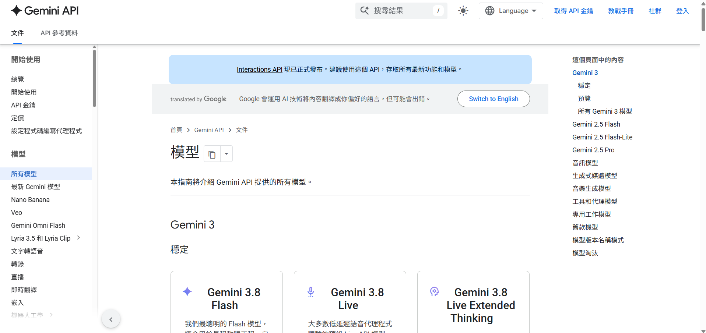
>
> 圖說：呈現本週實際查閱 Gemini 官方模型資訊的紀錄。

我接著查看 [Gemini API Pricing](https://ai.google.dev/gemini-api/docs/pricing)。以下為筆記保存的**本週查閱官方頁面時的定價**，每 1M tokens 計價，並非永久固定價格：

| 模型 | Input | Output（包含 thinking） |
| --- | --- | --- |
| Gemini 2.5 Pro | US$1.25（≤200k）；US$2.50（>200k） | US$10（≤200k）；US$15（>200k） |
| Gemini 2.5 Flash | text/image/video：US$0.30；audio：US$1.00 | US$2.50 |
| Gemini 2.5 Flash-Lite | text/image/video：US$0.10；audio：US$0.30 | US$0.40 |

> **圖片 #2、#3、#4｜Gemini API Pricing（同一組價格比較證據）**
>
> 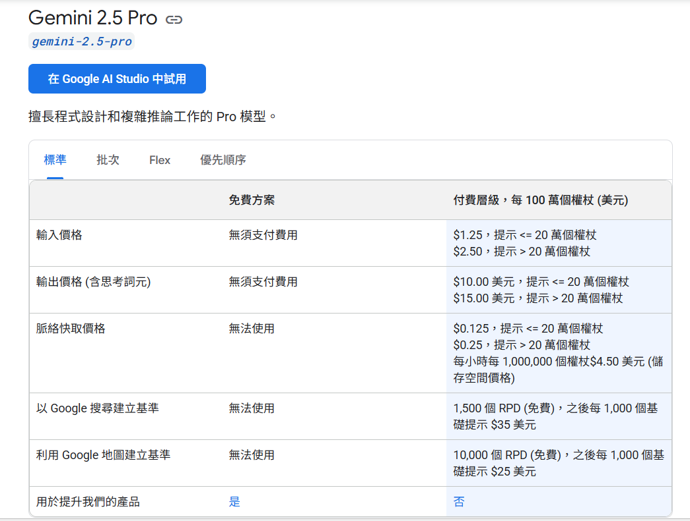
>
> 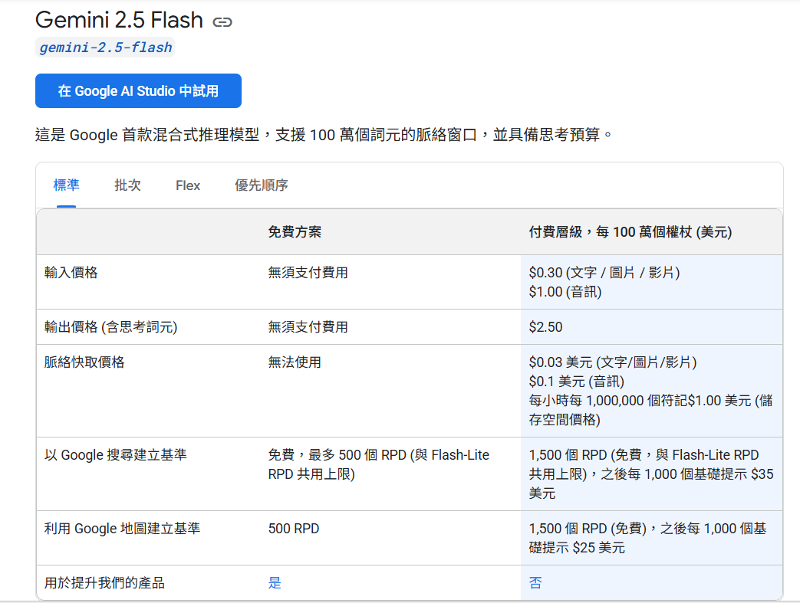
>
> 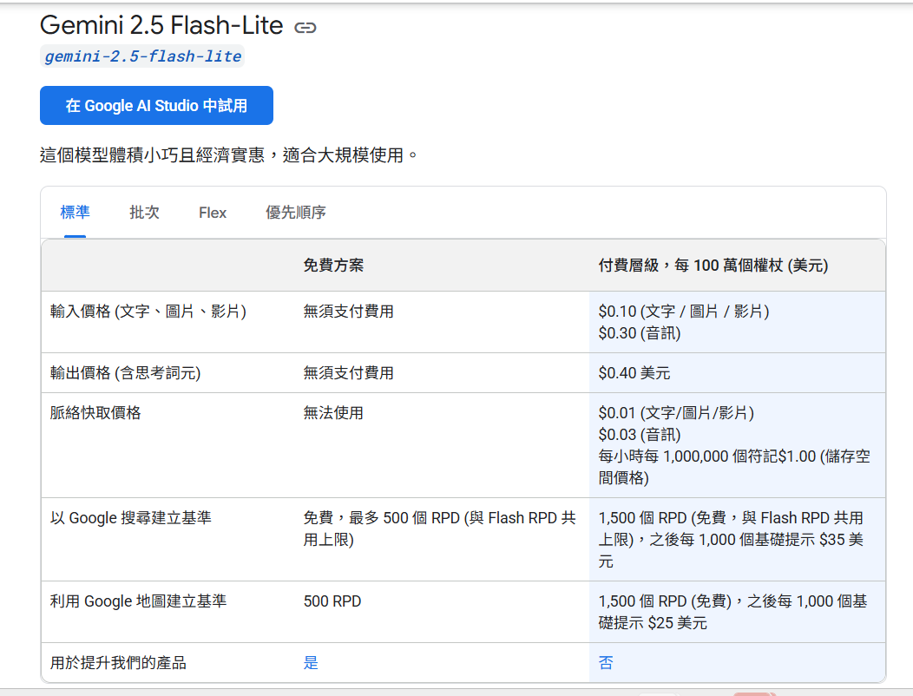
>
> 圖說：依序呈現當時查閱的 Gemini 2.5 Pro、Flash、Flash-Lite 官方 API 價格，不代表 Coze Credit 定價。

看到實際價格後，我的想法變成：

> 看到實際價格後，我認為應該先比對所需與模型提供的功能，達到模型功能利用最大化

### Coze：平台操作觀察與資料缺口

我實際查看 Coze Model Management、模型詳細頁、Free filter 與 Usage Records，嘗試尋找成本資訊。Free filter 顯示 Results 0，但帳號仍有可使用的 Credit。

我因此理解：**Coze 帳號有免費額度，不等於存在標示為 Free 的模型。**目前我沒有取得足以建立完整 Coze Credit 單價排名的官方資料，不能把模型供應商的 API 價格直接當成 Coze 的模型價格或 Credit 單價。

實作期間，我曾兩次遇到當日 Credit 用完，測試因此無法繼續。這讓我感受到成本與額度不只是價格表上的數字，也會限制能進行多少次測試。

## 四、Parameter 與 Distillation：從不知道到自己的定義

### Parameter

一開始被問到 Parameter 時，我的回答是「不知道」。

我的理解是：Parameter 是模型在訓練過程中學習到的數值，例如 weights 與 biases。Parameter 數量增加通常代表模型容量可能更大、能學習更複雜的模式，但不能只根據 parameter 數量判斷模型在特定任務上一定比較準確。

**正式來源查證：**我以 [Google Machine Learning Glossary](https://developers.google.com/machine-learning/glossary) 的 parameter 與 model capacity 詞條，核對上述參數定義與容量關係。

我也曾認為小模型可能因為比較小而比較專精，後來修正為：模型較小本身不代表專精，若經過適當訓練或微調，才可能在特定任務有很好的表現。這使我不再只用大小判斷模型是否適合。

### Distillation

我一開始同樣「不知道」什麼是蒸餾模型，後來形成的定義是：

> 用小模型學習其他較大模型的部分能力；用較小的模型容量學習與盡可能保留大模型的能力。

**正式來源查證：**查閱正式資料後，我發現這與 teacher model、student model 的概念相符：較小的 student model 學習模仿 teacher model 的輸出。[Google 的 Distillation 教材](https://developers.google.com/machine-learning/crash-course/llm/tuning) 也說明較小的蒸餾模型能降低推論所需的計算資源，但不代表結果一定完全等同 teacher。

我另外補入 [Distilling the Knowledge in a Neural Network](https://research.google/pubs/distilling-the-knowledge-in-a-neural-network/) 作為經典研究來源，不在這份報告展開公式或訓練方法。以上是我的概念理解與正式資料查證，並不是本週訓練或蒸餾模型的實驗成果。

## 五、在 Coze 建立第一個 Agent：包含踩坑

我一開始在 Development 頁面無法正常建立 Agent，重新整理後仍沒有解決。接著檢查 Workspace，發現沒有可用 Workspace，於是建立 Team「NCU AI Agent Learning」。建立 Team 後，Create 才可以使用，我也成功建立 Agent。

> **圖片 #6、#10｜Coze troubleshooting（問題 → 解決）**
>
> 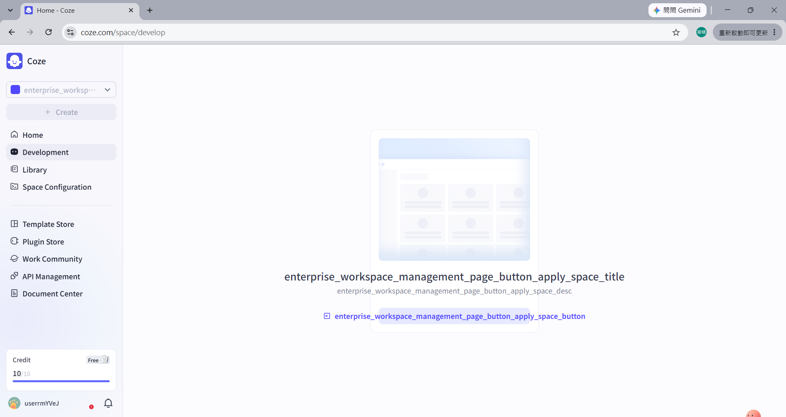
>
> 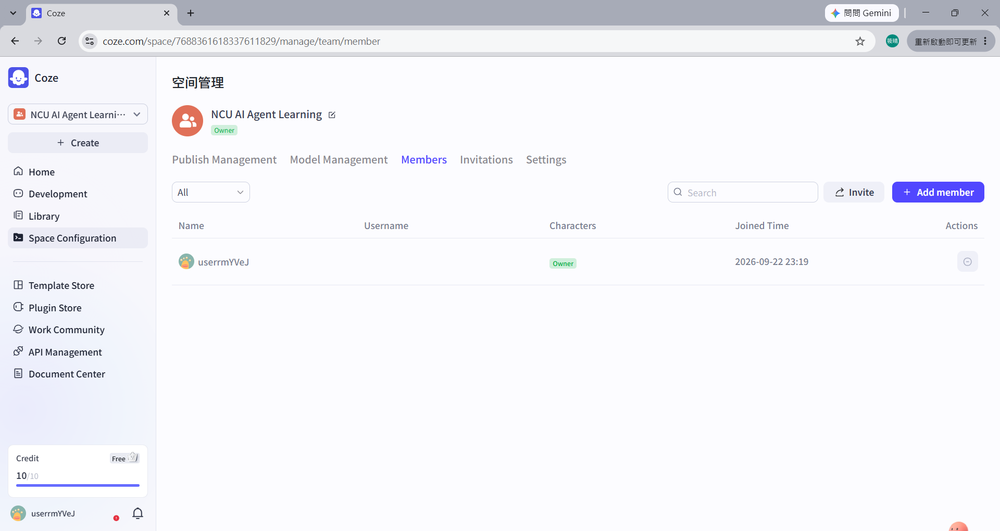
>
> 圖說：#6 呈現 Development 一開始無法正常建立；#10 呈現建立 Team 後可以繼續建立 Agent。

我建立的 Agent 名稱是 **Digital Life Support**，功能方向是協助處理日常數位裝置、App、帳號、檔案與資料相關問題。它目前是我學習 Agent 技術元件的實作載體，**不是已經決定的期末專題**。

> **圖片 #14｜Digital Life Support Agent editor**
>
> 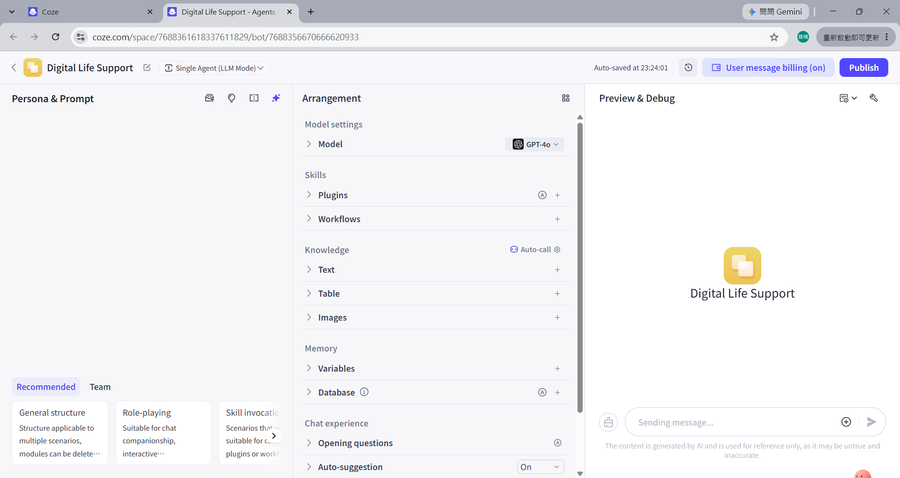
>
> 圖說：呈現第一個 Agent 已建立的編輯介面，不代表全部功能已完成驗證。

## 六、模型參數實驗

### （一）Temperature

我原本以為「Temperature 可能和模型運作時的耗能有關」，後來理解它主要影響生成內容的隨機性與多樣性，而不是耗能。

**實驗觀察：**我使用 GPT-4o，在 Temperature = 0 與 Temperature = 2 時輸入相同問題：

> Give me three ways to back up my computer files.

| 設定 | 回答的主要內容 |
| --- | --- |
| Temperature = 0 | External Hard Drive、Cloud Storage、Built-in Backup Tools |
| Temperature = 2 | External storage devices、Cloud backup services、Automatic backup software |

> **圖片 #26、#28｜Temperature = 0 / Temperature = 2（同一組實驗比較）**
>
> 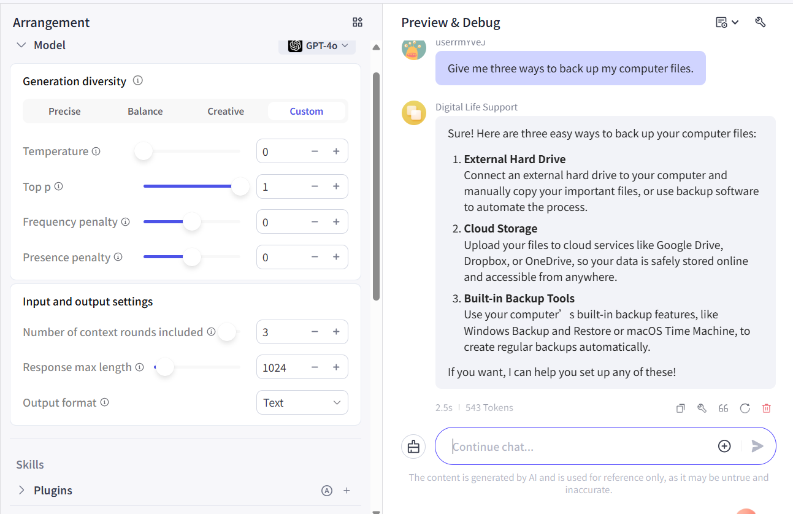
>
> 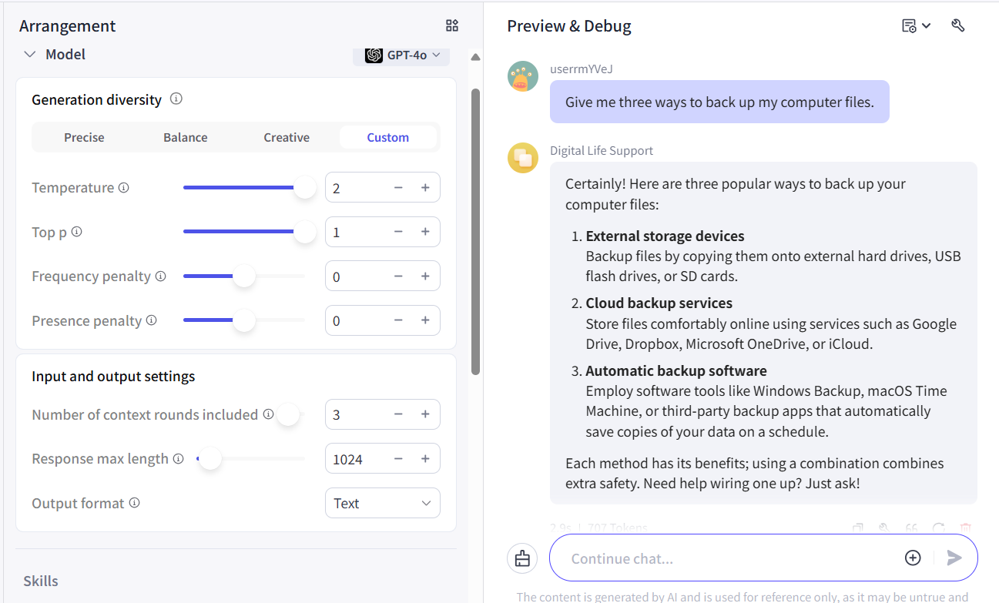
>
> 圖說：對照兩種設定下的實際回答，呈現本次核心答案相近的觀察。

我的實際觀察是：

> 我覺得差異沒有我想像中的大，可能是問題不太複雜的關係，答案的多樣性相差較少

其中「可能是問題不太複雜」是我的推測。後來我發現兩次測試在同一對話環境，且 **Context rounds = 3**，前文可能影響第二次回答，因此不是完全控制實驗。我不能單靠這次測試推論 Temperature 與速度、token 數量的因果關係，也不能認定它對所有問題都會產生巨大差異。

### （二）Response max length

一開始我猜它可能是「記憶體大小或輸出容量」，後來理解它控制的是單次回應的輸出上限，不是模型記憶體。我原先的預測是：

> Response max length 降低後，ways 可能會減少。

**實驗觀察：**我清空對話，把 Response max length 設為 5，再輸入同一個電腦檔案備份問題。模型只產生：

> Sure! Here are three

之後就停止。結果並不是主動減少備份方法的項目數，因此我的理解修正為：上限太小可能直接造成回答被截斷，而不是自動把完整內容濃縮。

> **圖片 #29｜Response max length = 5**
>
> 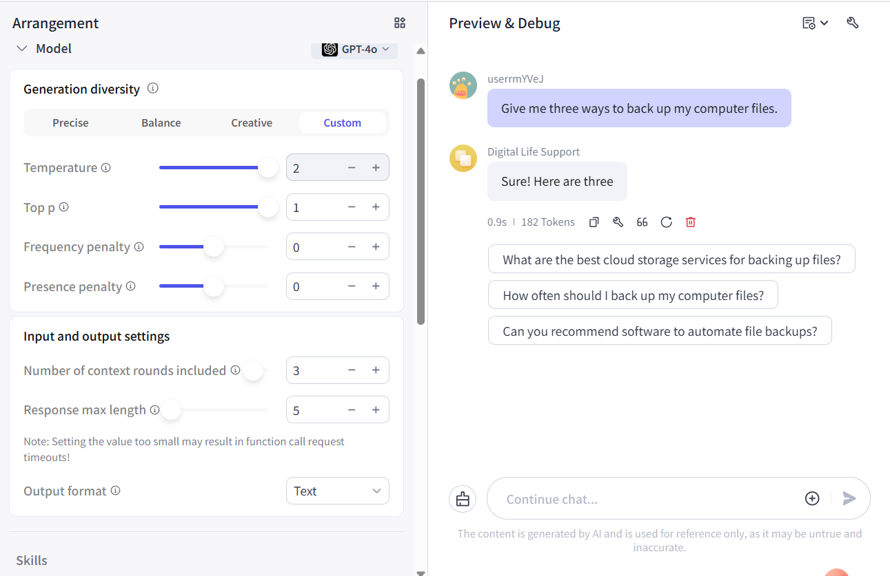
>
> 圖說：呈現回答停在未完成句子的實際結果；5 為介面設定值。

目前正式來源尚不足以確認 Coze 此設定的精確單位，因此我只記錄介面值「5」，不將它寫成「5 tokens」。

## 七、Context：修正另一個誤解

我一開始將 Number of context rounds included 理解成：

> 模型一次能跑幾份不同的資訊

後來才區分：**Context rounds** 是 Coze 產生下一次回答時納入多少輪先前對話；**Context Window** 是模型整體能處理的 Context 容量。前者像拿幾疊先前對話資料放到桌上，後者像桌面的總大小。

這也讓我回頭發現 Temperature 實驗沒有控制好前文。至於 Coze 更細部的輪數計算方式，本週尚未完成官方查證。

## 八、數位鑑識業務流程：先理解流程再談 Agent

依老師要求，我先理解數位鑑識業務流程，再思考 Agent 可以優化的位置，同時考慮能否實際使用、測試並取得回饋。

### 研究前的理解

我原本對完整流程的理解大約是：

> 設備與技術知識準備 → 確認需要哪些資訊及目前設備／技術限制 → Collection → Examination → Analysis → Reporting。

我原本認為 Collection 時需要注意資料存取時間與檔案修改歷史；研究後，才進一步理解資料完整性與 chain of custody 的重要性。

### 正式來源與研究後的修正

[NIST SP 800-86](https://nvlpubs.nist.gov/nistpubs/Legacy/SP/nistspecialpublication800-86.pdf) Section 3、Figure 3-1 的核心 forensic process 是：

> Collection → Examination → Analysis → Reporting。

為了建立較完整的流程理解，我依資料另外整理出較大的學習架構：

> 案件需求／調查問題 → 權限、程序與技術準備 → Collection → Examination → Analysis → Reporting → 證據保存／後續管理與流程改善。

**這是我依資料整理出的學習架構，不是 NIST 官方七階段模型。**

我原本對兩個階段的區分是：

> Examination主要提出事實，Analysis根據得到的資訊進一步做分析

研究後，我修正為：Examination 偏向辨識、擷取與整理相關資訊；Analysis 再利用這些結果進一步回答調查問題。這個修正讓我更能思考 Agent 到底要協助哪一部分工作。

### 我的 Reporting 延伸思考

我也想到報告可以說明：

> 過程中用到哪些技術模型、可能有哪些偏差

除了結果之外，我認為如果未來使用 AI Agent，也應思考是否需要說明使用的技術／模型及其可能限制或偏差。**這是我的延伸思考，不是 NIST 規定一定必須揭露 AI 模型偏差。**

> **圖片 #39｜數位鑑識原始理解與研究後修正**
>
> 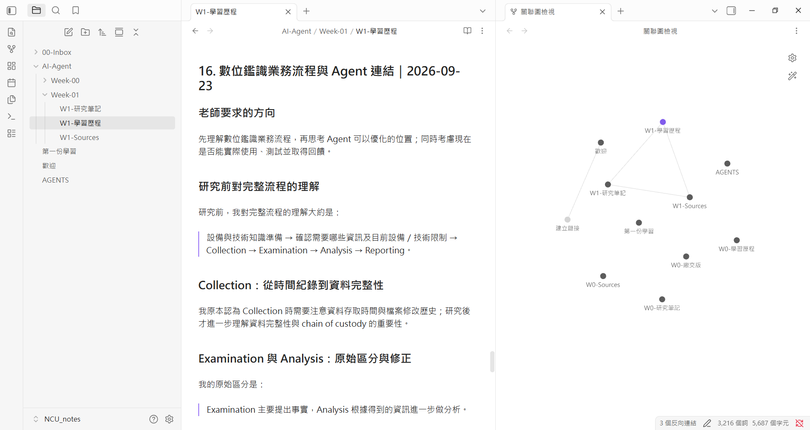
>
> 圖說：呈現原始想法經研究後的修正；較大流程是我的學習架構，並非 NIST 官方七階段模型。

## 九、Agent 可以放在哪裡？以及我為什麼縮小範圍

### 我感興趣的位置與模擬選擇

目前我最有興趣的是 Examination：希望 Agent 根據調查問題，從大量已取得的數位資料中，找出值得優先人工查看的項目並說明原因，而不是直接做案件結論。

在模擬情境中，紀錄包含 USB 18:32 接入、`backup_0915.zip` 18:35 建立。我選擇優先查看第 3 筆 `backup_0915.zip`，原始理由是：

> 我想知道檔案建立後內部資訊為何？

被問到取得相關資訊後下一步最想知道什麼時，我的原始回答是：

> 這些資訊被需要的原因

這只是模擬情境中的選擇與思考，不表示我已檢查檔案內容，也不能只因時間接近就認定事件具有因果關係。

> **圖片 #41｜Examination × Agent 模擬情境**
>
> 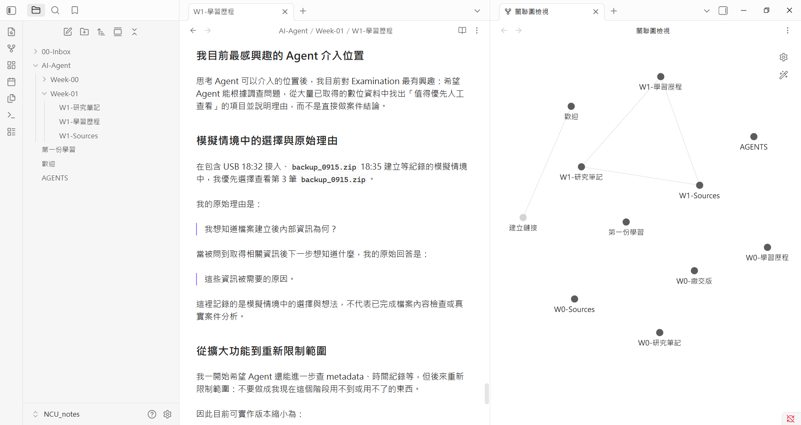
>
> 圖說：呈現優先查看項目的理由與後續問題，不是真實案件分析或已完成的鑑識結果。

### 從擴大功能到縮小範圍

我一開始希望 Agent 還可以繼續查 metadata、時間紀錄等，但後來重新限制：

> 不要做成我現在這階段用不到或用不了的

因此目前只保留一個現階段可實作的 prototype 構想：使用簡單、虛構且已整理好的檔案紀錄，例如檔名、時間、路徑、裝置活動。使用者輸入調查問題後，由 Agent 協助指出值得優先人工查看的項目並解釋原因，最後仍由使用者判斷推薦是否合理。

真正的鑑識工具、磁碟映像解析與複雜 API 暫時不做。**這只是目前可實作的構想，尚未完成與驗證。**

> **圖片 #42｜縮小到目前可實作版本＋連回 LLM Selection**
>
> 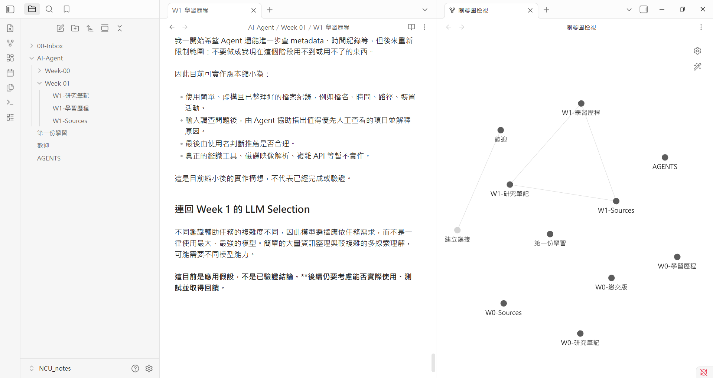
>
> 圖說：呈現從較大功能想法縮小到目前可實作構想的過程，不代表 prototype 已完成。

## 十、回到 Week 1：我現在會怎麼選模型

我現在的核心結論是：

> 根據需求的複雜程度選擇適合的模型，而不是單純講究模型要大要強，容易造成效能過剩，也較沒效率

連回數位鑑識，我形成以下應用假設：

- 大量、較單純的資訊整理，可能不需要最強模型。
- 需要理解多條線索關係的任務，可能需要能力更強的模型。
- 不同工作階段可能適合不同模型，而不是一律選擇最大、最強的模型。

**這些目前是我的應用假設，還沒有透過正式實驗驗證。**我需要先確認任務與回饋方式，才能進一步判斷模型是否合適。

## 十一、我仍然不確定的問題／想問老師

目前我已嘗試把方向縮小成使用虛構資料即可測試的 Examination 輔助構想，因此也想確認這樣是否比較符合「現在可使用／驗證」的課程期待。我仍想問老師：

> 我目前是把數位鑑識作為長期探索方向，每週先依課綱學習 Agent 的技術元件，再思考該元件是否能應用於數位鑑識，而不是現在就直接開發數位鑑識 Agent。想請問這樣的學習方向是否合適？另外考量數位鑑識目前較難取得真實使用回饋，期末專題是否建議另外選擇一個現階段能實際使用與驗證的題目？

## 參考來源與證據範圍

以下來源沿用 [W1-Sources](W1-Sources.md)；實驗觀察與原始回答整理自 [W1-學習歷程](W1-學習歷程.md)，知識整理參照 [W1-研究筆記](W1-研究筆記.md)。

| 正式來源 | 本週用途 |
| --- | --- |
| [Google Machine Learning Glossary](https://developers.google.com/machine-learning/glossary) | 補充查證 parameter 與 model capacity 的定義及關係 |
| [Google LLMs: Fine-tuning, distillation, and prompt engineering](https://developers.google.com/machine-learning/crash-course/llm/tuning) | 補充查證 teacher／student model、蒸餾與計算資源的關係 |
| [Google Research — Distilling the Knowledge in a Neural Network](https://research.google/pubs/distilling-the-knowledge-in-a-neural-network/) | Knowledge Distillation 經典研究補充來源 |
| [Coze LLM](https://www.coze.com/open/docs/guides/llm) | 課綱提供的 LLM 與模型設定參考資料 |
| [Coze Model Service](https://www.coze.com/open/docs/guides/model_service) | 課綱提供的模型服務參考資料 |
| [Coze Viewing Model](https://www.coze.com/open/docs/guides/viewing_model) | 課綱提供的模型查看參考資料 |
| [Gemini Models](https://ai.google.dev/gemini-api/docs/models) | 模型選項與定位調查 |
| [Gemini API Pricing](https://ai.google.dev/gemini-api/docs/pricing) | 本週查閱時的供應商 API 價格比較，不代表 Coze Credit 定價 |
| [NIST SP 800-86：Guide to Integrating Forensic Techniques into Incident Response](https://nvlpubs.nist.gov/nistpubs/Legacy/SP/nistspecialpublication800-86.pdf) | Section 3、Figure 3-1 核心流程；3.1.2 資料取得與完整性；3.2–3.4 階段區分；Section 2 與 3.4 作為準備及後續管理的參考 |

Coze 介面結果與模型回答是我的實作觀察，並非官方文件的結論；較大的流程學習架構、AI 模型偏差揭露及 Examination 輔助構想則是我的整理或推論。相關實作與學習過程已搭配本週實際截圖作為證據。
